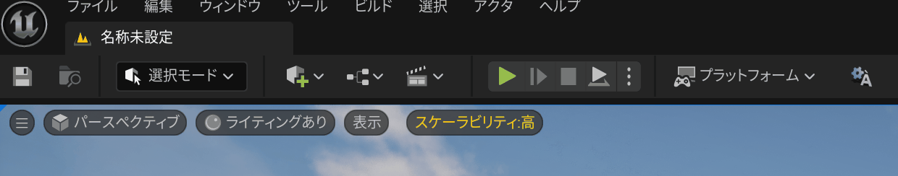

# UE-EditorLanguageToggle

## 日本語版

### 概要
このプラグインは通常使用しているEditorの言語⇔英語の切り替えを素早く行うためだけのプラグインです。

### セットアップ

Releaseの中から使用しているUnrealEngineのバージョンをダウンロードするか、このリポジトリを`Project/Plugins`以下に置きます。

リポジトリをクローンした際はビルド後、プロジェクトで`EditorLanguageToggle`をプラグインから有効にしてください。

### 使い方
https://github.com/user-attachments/assets/c4410e6f-92fd-483b-89af-8a380010895d

デフォルトでは画面上部に英語との言語切り替えボタンがあるので、それを押すことでEditorの言語が切り替わります。

`Editorの環境設定 > Plugins > Editor Language Toggle`の中に設定項目があります。

`Selected Culture`で使用するデフォルトの言語の設定をしてください。

`Enable Language Toggle`をOFFにすることでボタンの表示がされなくなります。

`Toolbar Position`をTopにすることでツールバー上にボタンの表示、Bottomにすることでステータスバーに表示されます。

## English Version
### Overview
This plugin allows you to quickly switch between your usual editor language and English.

### Setup
Download the version matching your Unreal Engine from the Releases, or place this repository under Project/Plugins.

If you cloned the repository, build your project and then enable `EditorLanguageToggle` from the Plugins menu in your project.

### Usage
https://github.com/user-attachments/assets/c4410e6f-92fd-483b-89af-8a380010895d

By default, a language toggle button appears at the top of the screen. Pressing this button will switch the editor language.

You can find settings under `Editor Preferences > Plugins > Editor Language Toggle`.

Set your default language using `Selected Culture`.

If you turn off `Enable Language Toggle`, the button will be hidden.

Set `Toolbar Position` to Top to display the button in the toolbar, or Bottom to display it in the status bar.
